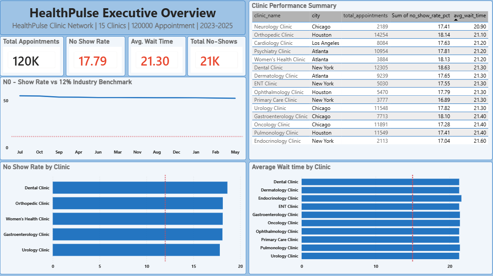
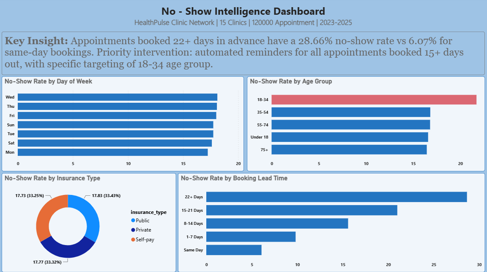
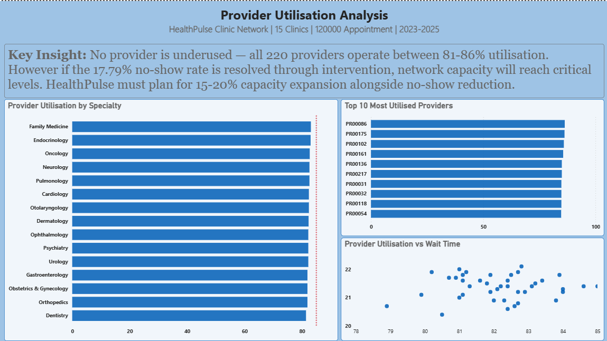

# healthpulse-clinic-analytics

## Project Overview
An end-to-end healthcare analytics project for 
HealthPulse Clinic Network, a 15-clinic provider 
serving 100,000+ patients. This project transforms 
raw appointment data into a Star Schema data 
warehouse and delivers a 3-page Power BI 
dashboard addressing the network's most pressing 
operational challenges.

---

## Business Challenge
HealthPulse was experiencing no-show rates above 
industry average, wait times exceeding target, 
and no centralised way to analyse performance 
across its 15 clinics.

---

## Data Architecture

Built a Star Schema from a 120,000-row 
denormalised dataset:

- **fact_appointments** (120,000 rows) — central 
  fact table
- **dim_patients** (5,000 rows) — patient 
  demographics and insurance
- **dim_providers** (220 rows) — provider 
  specialty and clinic assignment
- **dim_clinics** (15 rows) — clinic and 
  city information
- **dim_dates** (1,096 rows) — date dimension 
  for temporal analysis

---

## Key Findings

### Executive Overview
- No-show rate is 17.79% — 48% above the 
  12% industry benchmark, representing 21,344 
  missed appointments
- Average wait time is 21.3 minutes — 42% 
  above the 15-minute target, consistent 
  across all 36 months
- Dental Clinic New York has the highest 
  no-show rate at 18.63%

### No-Show Intelligence
- Booking lead time is the strongest predictor — 
  appointments booked 22+ days out have a 
  28.66% no-show rate vs 6.07% for same-day 
  bookings
- Patients aged 18-34 have a 21.72% no-show 
  rate, nearly 5 points higher than any 
  other age group
- Insurance type has minimal impact 
  (17.73%-17.83% across all types)

### Provider Utilisation
- All 220 providers operate within a narrow 
  81-86% utilisation band — no significant 
  underuse found
- Family Medicine has the highest utilisation 
  at 83.1%, Dentistry the lowest at 81.4%
- If no-show rates were resolved, network 
  utilisation would approach capacity limits, 
  requiring 15-20% capacity expansion planning

---

## Recommendations
1. Implement escalating reminder protocols for 
   appointments booked 15+ days in advance
2. Target SMS/app-based interventions 
   specifically at patients aged 18-34
3. Investigate Dentistry's combined high 
   no-show rate and lowest utilisation
4. Begin capacity planning for a 15-20% 
   demand increase if no-show interventions 
   succeed

---

## Tools Used
- **PostgreSQL** — Star Schema data warehouse
- **SQL** — KPI calculation and analysis
- **Power BI** — 3-page interactive dashboard

---

## Dashboard Pages

### Page 1: Executive Overview

### Page 2: No-Show Intelligence

### Page 3: Provider Utilisation

---

## How to Run
1. Load the raw dataset into PostgreSQL as 
   `staging_appointments`
2. Run scripts in `/sql` in numbered order 
   to build the Star Schema
3. Open `HealthPulse_Analytics_Dashboard.pbix` 
   in Power BI Desktop

---

*Created by Benjamin Dadzie | June 2026*
